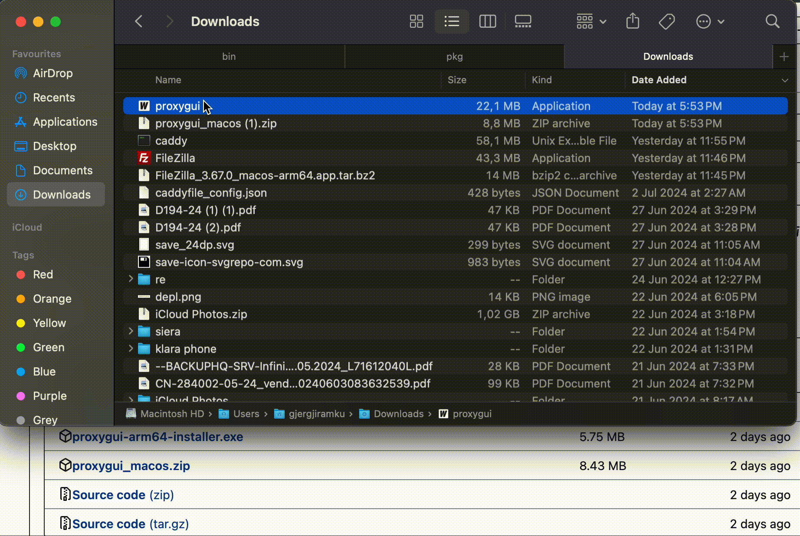
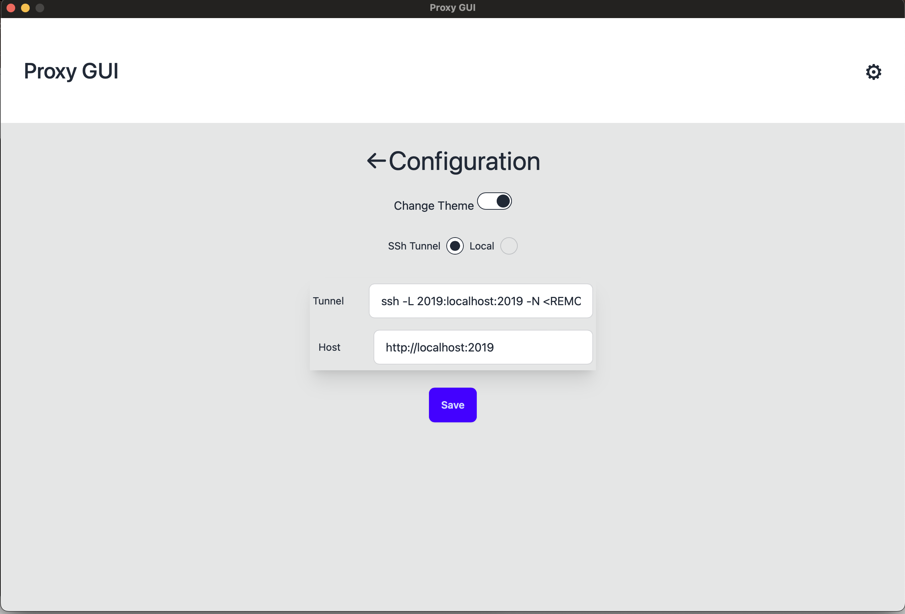
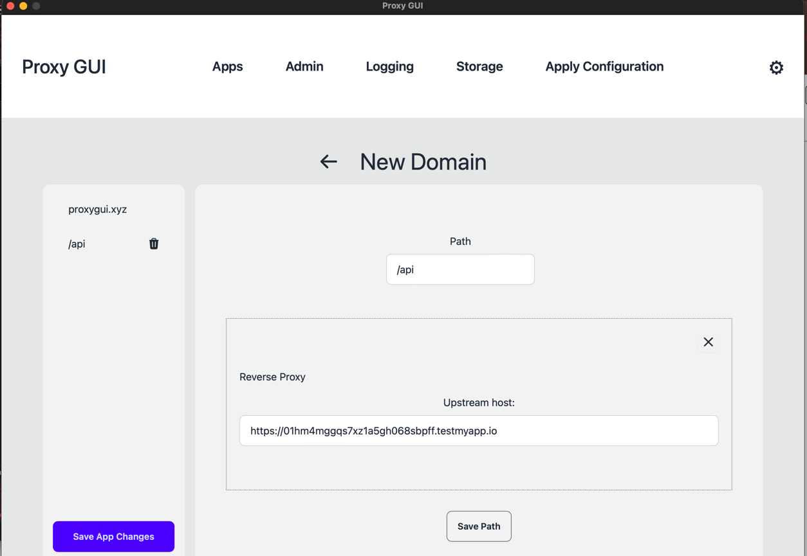
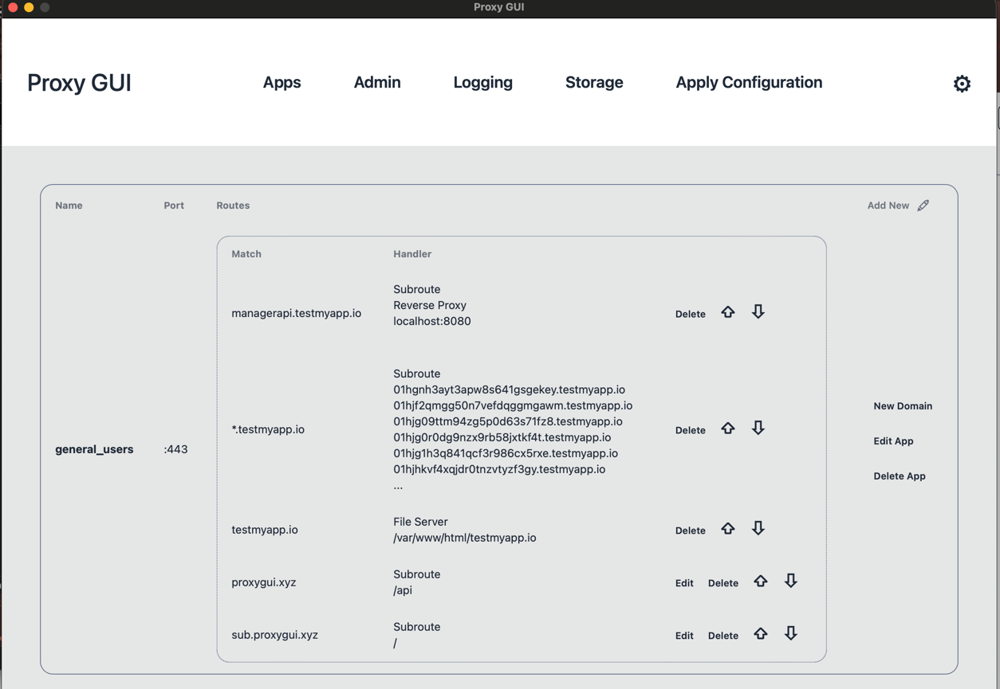

# Configure Caddy Server with GUI

### Features
* Supports Caddy v2.7.6
* Supports easily configuring domains with File Server, Reverse Proxy, and static responses

## [Download](https://github.com/Gjergj/proxy_gui/releases)

### Test it locally first
* Clone this repository
* run `docker-compose up -d` which will create:
    * a Caddy server
    * Ghost blogging platform `ghost_subdomain:2368` which can be used to test the reverse proxy with `subdomain.localhost`
    * Ghost blogging platform `ghost_path:2368` which can be used to test the reverse proxy with `subwithpath.localhost/blog`
    * serve files from /srv

### For feedback or bugs report please [open an issue](https://github.com/Gjergj/proxy_gui/issues)

[//]: # (![]&#40;assets/0616.gif&#41;)

### Troubleshooting

* If you get `Is Damaged and Can’t Be Opened. You Should Move It To The Trash` run on the terminal `xattr -c proxygui-arm64`
### Screenshots

